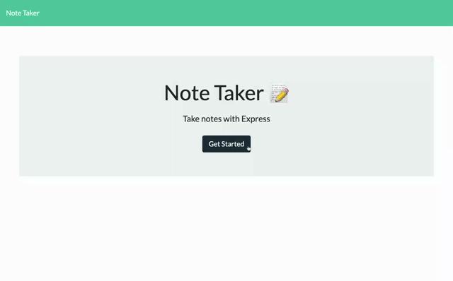

# Note Taker
A note-taking application that can be used to write, save and delete notes. This application uses an Express.js back end and saves and retrieves note data from a JSON file.

Link to deployed application: https://rn-note-taker.herokuapp.com/

